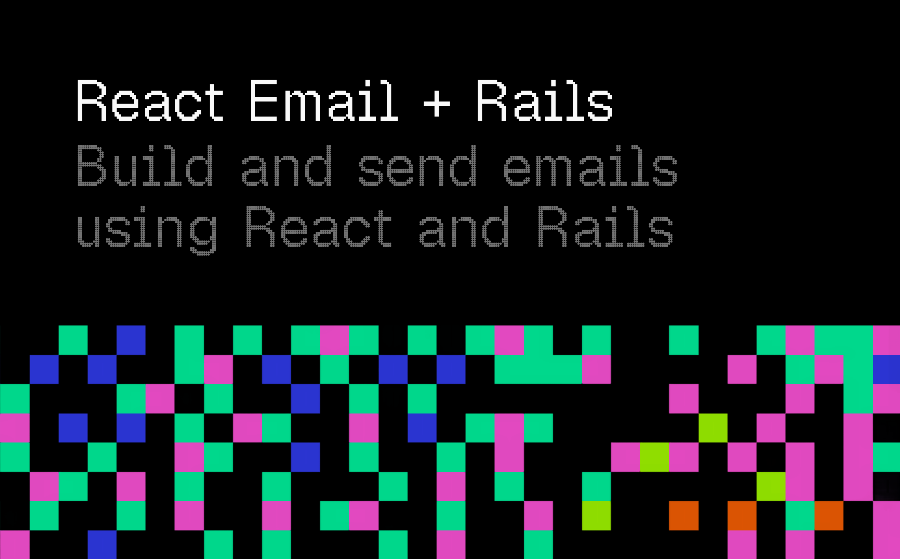

# react-email-rails

Build and send Action Mailer emails with [React Email](https://react.email), TypeScript, and Vite.

react-email-rails lets Rails render React Email components into HTML and plain text, then deliver them through the Action Mailer stack you already know: previews, headers, callbacks, queues, instrumentation, and delivery all keep working normally.

## Why

HTML email is still awkward. React Email gives you a nicer component model, email-safe primitives, Tailwind support, and TypeScript. This gem connects that workflow to Rails without replacing Action Mailer.

You get:

- React Email components rendered from `mail(...)`
- HTML and plain-text output from the same component
- Rails mailer previews, tests, queues, callbacks, and delivery
- Vite-powered development rendering
- A production renderer bundle built during `assets:precompile`
- Optional persistent rendering for high-volume workers

## Status

react-email-rails is pre-1.0. It was extracted from [XOXO](https://xoxo.email), which is pre-launch, so the API may still change and it has not yet been battle-tested in high-volume production.

The supported Ruby, Rails, Node, React, and Vite versions are tested in CI. Please [open an issue](https://github.com/heysupertape/react-email-rails/issues) for bugs, rough edges, or integration feedback.

## Contents

- [Requirements](#requirements)
- [Installation](#installation)
- [Quick Start](#quick-start)
- [Rendering](#rendering)
- [Usage](#usage)
- [Configuration](#configuration)
- [Deployment](#deployment)
- [Development](#development)
- [Contributing](#contributing)
- [Security](#security)
- [License](#license)

## Requirements

| Dependency | Version |
|------------|---------|
| Ruby | >= 3.3 |
| Rails | Action Mailer, Active Support, and Railties >= 7.1 and < 9.0 |
| Node | >= 20.19 |
| Vite | 7 or 8 |
| React | 18 or 19 |
| `@react-email/render` | 2.x |

We recommend [rails_vite](https://github.com/skryukov/rails_vite/) for Vite in Rails apps.

## Installation

Add the Ruby gem:

```ruby
# Gemfile
gem "react-email-rails"
```

Then install it with Rails:

```sh
bundle install
bin/rails generate react_email_rails:install
```

The installer creates `config/initializers/react_email_rails.rb`, installs missing JavaScript dependencies when it can detect your package manager, adds `reactEmailRails()` to `vite.config.*`, and creates `app/javascript/emails`.

After installation, the normal Rails flow applies:

- Generate mailers and components with `bin/rails generate react_email_rails:email ...`.
- Run `bin/dev` in development; email components render through Vite on demand.
- Run `bin/rails assets:precompile` for production; the renderer bundle builds automatically.
- Run `bin/rails react_email_rails:build` directly when CI or tests need the bundle without the full asset task.

### Manual Setup

If you prefer to wire things up yourself, install the npm package and React Email dependencies:

```sh
npm i react-email-rails @react-email/render @react-email/components react react-dom
```

Use the equivalent command for pnpm, Yarn, or Bun if your app uses a different package manager.

Then add the Vite plugin:

```ts
// vite.config.ts
import { defineConfig } from "vite"
import { reactEmailRails } from "react-email-rails"

export default defineConfig({
  plugins: [reactEmailRails()],
})
```

## Quick Start

Generate a mailer and React Email component:

```sh
bin/rails generate react_email_rails:email Account welcome
```

The generator follows Rails' mailer generator shape: `NAME [method method]`. It creates a mailer, React component, mailer preview, and test. It also reads `emails.path` and `emails.extension` from `reactEmailRails()` when available.

Pass flags when you need to override the detected component directory or extension:

```sh
bin/rails generate react_email_rails:email Account welcome --emails-path=app/emails --extension=jsx
```

Update the generated mailer to pass props into the React component:

```ruby
class AccountMailer < ApplicationMailer
  def welcome
    account = params.fetch(:account)

    mail(
      to: account.email,
      subject: "Welcome",
      react: {
        account: {
          name: account.name,
        },
      },
    )
  end
end
```

Then edit the generated component:

```tsx
// app/javascript/emails/account_mailer/welcome.tsx
import { Body, Container, Html, Text } from "@react-email/components"

type WelcomeProps = {
  account: {
    name: string
  }
}

export default function Welcome({ account }: WelcomeProps) {
  return (
    <Html>
      <Body>
        <Container>
          <Text>Welcome, {account.name}</Text>
        </Container>
      </Body>
    </Html>
  )
}
```

Deliver it like any other Action Mailer email:

```ruby
AccountMailer.with(account: current_account).welcome.deliver_later
```

React Email also provides primitives like [`<Button>`, `<Heading>`, `<Tailwind>`, and more](https://react.email/docs/components/html).

## Rendering

In development, react-email-rails renders components through Vite's dev pipeline. Your email components get the same module resolution and transforms as the rest of your frontend.

In production, `assets:precompile` builds a server-side renderer bundle from your Vite config. Rails runs that bundle with Node whenever an email needs to render.

Every `react:` email renders HTML and plain text from the same component. If rendering fails, the email is not sent and `ReactEmailRails::RenderError` is raised.

### Live-Reloading Previews

In development, Action Mailer previews automatically reload themselves when you edit an email component. react-email-rails registers a [preview interceptor](https://api.rubyonrails.org/classes/ActionMailer/Base.html#class-ActionMailer::Base-label-Previewing+emails) that injects `@vite/client` into the preview, and the `reactEmailRails()` plugin broadcasts a full reload over Vite's websocket whenever a file under your emails directory changes.

The `live_reload_url` defaults to Vite's `http://localhost:5173`, but you can point elsewhere if needed, or set it to a falsy value to disable live reload. (See [Configuration](#configuration))

```ruby
ReactEmailRails.configure do |config|
  config.live_reload_url = "http://localhost:3036" # or nil or false to disable
end
```

## Usage

### Passing Props

Top-level keys passed to `react:` become props on the component's default export. The API is intentionally close to [inertia-rails](https://inertia-rails.dev), so apps using both libraries should feel consistent.

```ruby
mail(
  to: account.email,
  subject: "Welcome",
  react: {
    account: {
      name: account.name,
    },
  },
)
```

```tsx
type WelcomeProps = {
  account: {
    name: string
  }
}

export default function Welcome({ account }: WelcomeProps) {
  // ...
}
```

### Component Inference

By default, react-email-rails infers the component from the mailer and action:

| Mailer action | Component |
|---------------|-----------|
| `AccountMailer#welcome` | `account_mailer/welcome` |
| `Users::InviteMailer#new_invite` | `users/invite_mailer/new_invite` |

`AccountMailer#welcome` resolves to `app/javascript/emails/account_mailer/welcome.tsx` or `.jsx` with the default Vite options.

Use `react: true` to render the inferred component. By default it renders with no props, which is handy for emails that take none:

```ruby
mail(to: account.email, subject: "Welcome", react: true)
```

To have `react: true` build props automatically, enable `use_react_instance_props`. The component then receives the mailer's instance variables as props:

```ruby
class AccountMailer < ApplicationMailer
  use_react_instance_props

  def welcome
    @account = params.fetch(:account)

    mail(to: @account.email, subject: "Welcome", react: true)
  end
end
```

Action Mailer's framework assigns, including `params` and `rendered_format`, are excluded from instance props.

To make React the default for every action, set `default react: true` on the mailer (or `ApplicationMailer`). Each `mail` call then renders the inferred component without repeating `react: true`, and a single action can opt back out with `react: false`:

```ruby
class ApplicationMailer < ActionMailer::Base
  default react: true
end
```

### Explicit Components

Pass a component name when the mailer action and component path do not line up:

```ruby
mail(
  to: account.email,
  subject: "Welcome",
  react: "accounts/welcome",
  props: {
    account: {
      name: account.name,
    },
  },
)
```

To change naming globally, override `component_path_resolver` in your [Rails configuration](#rails-configuration).

### Shared Props

Use `react_email_share` to merge props into every `react:` email for a mailer and its subclasses:

```ruby
class MarketingMailer < ApplicationMailer
  react_email_share app_name: "Acme"

  react_email_share unread_count: -> { params[:account]&.unread_count }

  react_email_share do
    { brand: { name: "Acme", url: marketing_url } }
  end
end
```

Per-mail props win over shared props of the same name:

```ruby
mail(
  to: account.email,
  subject: "Welcome",
  react: {
    app_name: "Acme Pro",
  },
)
```

Shared props work with `react:` hashes, `react: true`, and explicit `react: "component", props: ...` calls.

### Conditional Shared Props

`react_email_share` accepts the same filter options as `before_action`: `only`, `except`, `if`, and `unless`.

```ruby
react_email_share only: [:welcome, :reactivation] do
  { promotion: params.fetch(:promotion) }
end

react_email_share if: :account_active? do
  { account: { name: params.fetch(:account).name } }
end
```

You can also share props inside an action before calling `mail`:

```ruby
def welcome
  account = params.fetch(:account)

  react_email_share notice: "Thanks for joining!"

  mail(
    to: account.email,
    subject: "Welcome",
    react: { account: account.as_json(only: [:name]) },
  )
end
```

### Deep Merging Shared Props

Shared props are merged shallowly by default. That means a per-mail prop replaces a shared prop with the same name.

Pass `deep_merge: true` to merge nested hashes instead:

```ruby
react_email_share do
  { settings: { theme: "light", locale: "en" } }
end

mail(
  to: account.email,
  subject: "Welcome",
  react: {
    settings: {
      theme: "dark",
    },
  },
  deep_merge: true,
)
```

The component receives:

```ruby
{ settings: { theme: "dark", locale: "en" } }
```

Set `config.deep_merge_shared_props = true` to make deep merging the default for every email.

### Mailer and Message Props

Every `react:` email receives `mailer` and `message` props, mirroring the [`mailer` and `message` view helpers](https://guides.rubyonrails.org/action_mailer_basics.html#action-mailer-view-helpers) available to Action Mailer ERB views.

`mailer` identifies the mailer action. `message` reflects the email after Action Mailer has assigned headers and defaults, including default `from` and `reply_to` values. With the default prop transform, import the `Mailer` and `Message` types to annotate them:

```tsx
import type { Mailer, Message } from "react-email-rails"
import { Body, Container, Html, Text } from "@react-email/components"

type WelcomeProps = {
  account: { name: string }
  mailer: Mailer
  message: Message
}

export default function Welcome({ account, mailer, message }: WelcomeProps) {
  return (
    <Html>
      <Body>
        <Container>
          <Text>Welcome, {account.name}</Text>
          <Text>Re: {message.subject}</Text>
        </Container>
      </Body>
    </Html>
  )
}
```

| Prop | Example |
|------|---------|
| `mailer.mailerName` | `"account_mailer"` |
| `mailer.actionName` | `"welcome"` |
| `message.subject` | `"Welcome"` |
| `message.to` | `["account@example.com"]` |
| `message.cc`, `message.bcc` | `["…"]` or `null` |
| `message.from`, `message.replyTo` | `["app@example.com"]` |

Context is merged before prop serialization, so keys follow `config.transform_props` just like your own props. The exported TypeScript types describe the default `:lower_camel` shape.

Per-mail and shared props win on conflict, so a prop named `mailer` or `message` overrides the injected context. Serializer props receive the context when `as_json` returns a hash. Collections, arrays, and other non-object values pass through unchanged so their top-level shape is preserved.

### Prop Serialization

Props are serialized with `as_json`, just like `render json:`. You can pass hashes, arrays, Active Model objects, and serializer output from libraries such as [Alba](https://github.com/okuramasafumi/alba) or [ActiveModel::Serializer](https://github.com/rails-api/active_model_serializers).

Prop keys are camelized by default, so `plan_name` arrives in React as `planName`. See [Prop Transformation](#prop-transformation) to change that behavior.

### Component Files

Files and directories starting with `_` are ignored as renderable email entries by default. Use them for shared components, layouts, and helpers:

```text
app/javascript/emails/
  account_mailer/
    welcome.tsx
  _components/
    email_layout.tsx
```

Ignored files can still be imported by email components.

### Layouts

Action Mailer layouts are not applied to `react:` emails. In React Email, layouts are normal React components:

```tsx
// app/javascript/emails/_components/email_layout.tsx
import { Body, Container, Html } from "@react-email/components"
import type { ReactNode } from "react"

type EmailLayoutProps = {
  children: ReactNode
}

export function EmailLayout({ children }: EmailLayoutProps) {
  return (
    <Html>
      <Body>
        <Container>{children}</Container>
      </Body>
    </Html>
  )
}
```

```tsx
// app/javascript/emails/account_mailer/welcome.tsx
import { Text } from "@react-email/components"
import { EmailLayout } from "../_components/email_layout"

export default function Welcome() {
  return (
    <EmailLayout>
      <Text>Welcome</Text>
    </EmailLayout>
  )
}
```

## Configuration

Configuration lives in two places:

- Rails configuration controls mailer behavior, prop handling, rendering mode, timeouts, and error hooks.
- Vite configuration controls email component discovery and the renderer bundle.

### Rails Configuration

Override Rails-side defaults in `config/initializers/react_email_rails.rb`:

```ruby
ReactEmailRails.configure do |config|
  # config.render_mode = :persistent
end
```

| Option | Default |
|--------|---------|
| `component_path_resolver` | `->(mailer:, action:) { "#{mailer}/#{action}" }` |
| `transform_props` | `:lower_camel` |
| `render_mode` | `:subprocess` |
| `render_options` | `{}` |
| `render_timeout` | `10` seconds |
| `render_process_max_requests` | `1_000` |
| `on_render_error` | `nil` |
| `deep_merge_shared_props` | `false` |
| `live_reload_url` | `http://localhost:5173` |

### Prop Transformation

Set `transform_props` to choose how Ruby prop keys are exposed to React:

| Value | Example |
|-------|---------|
| `:camel` | `AccountName` |
| `:lower_camel` | `accountName` |
| `:dash` | `account-name` |
| `:snake` | `account_name` |
| `:none` | preserves serialized keys |

```ruby
ReactEmailRails.configure do |config|
  config.transform_props = :none
end
```

Only prop keys are transformed. Values are always serialized with `as_json`.

### Render Modes

The default `:subprocess` mode starts a fresh Node process for each render. It is simple, isolated, and always uses the latest bundle, but it pays Node startup and bundle load time for each email.

`:persistent` mode keeps one long-lived Node child process per Ruby process. It is faster for render-heavy workers, but uses more memory and can serve a stale component until the child is recycled.

Switch to persistent mode when Node startup shows up in traces or when a worker renders many emails from the same bundle:

```ruby
ReactEmailRails.configure do |config|
  config.render_mode = :persistent
end
```

Persistent mode details:

- Renders are newline-delimited JSON and processed one at a time.
- Throughput scales with more worker processes.
- It is fork-safe; clustered Puma and forking job runners spawn one Node child per worker.
- The child recycles after `render_process_max_requests` renders. Set that option to `nil` to disable recycling.

### Render Options

`render_options` is passed to [@react-email/render](https://react.email/docs/utilities/render). Use `html` and `text` keys to configure each output. Option keys are camelized before they cross into JavaScript.

```ruby
ReactEmailRails.configure do |config|
  config.render_options = {
    html: {
      pretty: Rails.env.development?,
    },
    text: {
      html_to_text_options: {
        selectors: [{ selector: "img", format: "skip" }],
      },
    },
  }
end
```

`render_options` can also be a callable. When rendering from a mailer, it is evaluated in the mailer instance so it can use helpers or per-email state.

### Error Reporting

Use `on_render_error` to report failures before the exception is re-raised:

```ruby
ReactEmailRails.configure do |config|
  config.on_render_error = ->(error, **context) {
    Rails.error.report(error, context:)
  }
end
```

The callback receives the error plus render context such as `component:`.

### Instrumentation

Every render emits `render.react-email-rails` through [ActiveSupport::Notifications](https://guides.rubyonrails.org/active_support_instrumentation.html). Payloads include `component` and successful HTML size in `html_bytes`.

```ruby
ActiveSupport::Notifications.subscribe("render.react-email-rails") do |event|
  Rails.logger.info(
    "[react-email-rails] Rendered #{event.payload[:component]} " \
      "(#{event.duration.round}ms, #{event.payload[:html_bytes]} bytes)",
  )
end
```

### Vite Configuration

Most apps only need the plugin from [Installation](#installation):

```ts
import { defineConfig } from "vite"
import { reactEmailRails } from "react-email-rails"

export default defineConfig({
  plugins: [reactEmailRails()],
})
```

The isolated renderer loads `reactEmailRails()`, JSX support, and component-facing Vite config such as `resolve`, `define`, `css`, `json`, `assetsInclude`, `esbuild`, and `oxc`. It does not load your other app plugins unless you explicitly add them with `vite.plugins`.

Server, preview, dependency optimization, and build output settings stay owned by react-email-rails so Rails can always find the renderer bundle.

### Vite Plugin Options

| Option | Default | Description |
|--------|---------|-------------|
| `emails.path` | `"app/javascript/emails"` | Directory containing email components |
| `emails.extension` | `[".tsx", ".jsx"]` | Component extension, or an array of extensions |
| `emails.ignore` | `["**/_*", "**/_*/**"]` | Glob patterns ignored under `emails.path` |
| `standalone` | `true` | Inline production renderer bundle dependencies |
| `vite` | `{}` | Extra email-only Vite config for compilation and resolution |

Use a custom email directory:

```ts
reactEmailRails({
  emails: "app/emails",
})
```

Use custom extensions:

```ts
reactEmailRails({
  emails: {
    extension: [".email.tsx", ".email.jsx"],
  },
})
```

Component names come from the Vite directory layout. To map mailer actions to a different layout, override `component_path_resolver` on the Ruby side so both halves stay in sync.

### Email-Only Vite Plugins

Most apps do not need extra email plugins. If email components need a transform that is not part of Vite's default pipeline, add it to the isolated renderer:

```ts
import mdx from "@mdx-js/rollup"
import { defineConfig } from "vite"
import { reactEmailRails } from "react-email-rails"

export default defineConfig({
  plugins: [
    reactEmailRails({
      vite: {
        plugins: [mdx()],
      },
    }),
  ],
})
```

Only `assetsInclude`, `css`, `define`, `esbuild`, `json`, `oxc`, `plugins`, and `resolve` are accepted inside `vite`. Output settings such as `build.outDir` and `build.rollupOptions` are ignored.

### Standalone Builds

By default, the production renderer bundle inlines React, `@react-email/render`, and other Node dependencies. This works well for Rails deploys that build assets in one stage and run without `node_modules` in the final image.

Set `standalone: false` when your runtime ships `node_modules` and you prefer a smaller SSR-style bundle:

```ts
reactEmailRails({
  standalone: false,
})
```

Externalized bundles can be smaller and may build faster, but the externalized packages must be available at runtime.

## Deployment

Production deploys should run the normal Rails asset task:

```sh
bin/rails assets:precompile
```

react-email-rails hooks `react_email_rails:build` into `assets:precompile`. The build task loads `reactEmailRails()` options from your Vite config and writes `tmp/react-email-rails/emails.js` with the email component registry.

You can run the renderer build directly:

```sh
bin/rails react_email_rails:build
```

Production rendering requires that bundle. If it is missing, rendering raises `ReactEmailRails::RenderError` and Action Mailer does not send the email.

Set `SKIP_REACT_EMAIL_RAILS_BUILD=1` to skip the automatic asset hook. Directly running `bin/rails react_email_rails:build` always attempts the build.

The npm package, Vite, React, and `@react-email/render` must be available when Rails runs `assets:precompile`.

The Ruby gem and npm package must stay on the same version. A protocol/version handshake catches mismatched installs and raises an actionable `ReactEmailRails::RenderError`.

### Verify the Renderer

Run this before relying on the production renderer:

```sh
bin/rails react_email_rails:verify
```

It checks that the render command runs and that the npm package version matches the gem. It exits non-zero with an actionable message on failure, so it is safe to wire into CI or release steps.

For programmatic checks, `ReactEmailRails.healthy?` returns a boolean:

```ruby
Rails.application.config.after_initialize do
  if Rails.env.production? && Sidekiq.server? && !ReactEmailRails.healthy?
    Rails.logger.error("[react-email-rails] renderer verification failed")
  end
end
```

If you check at boot, scope it to processes that send mail so the rest of the app does not pay the cost.

## Development

See [CONTRIBUTING.md](CONTRIBUTING.md) for local setup, checks, formatting, and release verification.

The short version:

```sh
bundle install
cd vite && pnpm install
```

Run the core checks before opening a pull request:

```sh
ruby scripts/check_version_sync.rb
bin/test
bin/lint
cd vite && pnpm run build
```

## Contributing

Bug reports and pull requests are welcome. Please read [CONTRIBUTING.md](CONTRIBUTING.md) before opening a pull request so the local checks and release expectations are clear.

## Security

Please report vulnerabilities privately. See [SECURITY.md](SECURITY.md) for details.

## License

The Ruby gem and npm package are available as open source under the terms of the [MIT License](LICENSE.md).
